# MiserMe

View the video demo by clicking [here](https://youtu.be/0HwxuUpiMC0).

A simple, free form budgeting / financial Flask application built using Python, SQLite3, HTML, CSS, and JavaScript.

MiserMe is an application that can help users log, budget, and record their finances. I usually do my finances using Microsoft Excel, but grew tired of continually creating, styling, and manually editing each cell. I created MiserMe to help accelerate my financial recordings, and create files for my records on the fly. The biggest strength in MiserMe is it's ability to record every tiny change made to your budget, including that unexpected $3 bill you found as you were walking home from class.

 
 
 

<h2 align="center">Preview: Login and Register</h2>

Unregistered users will have to create an account before proceeding to use the application.

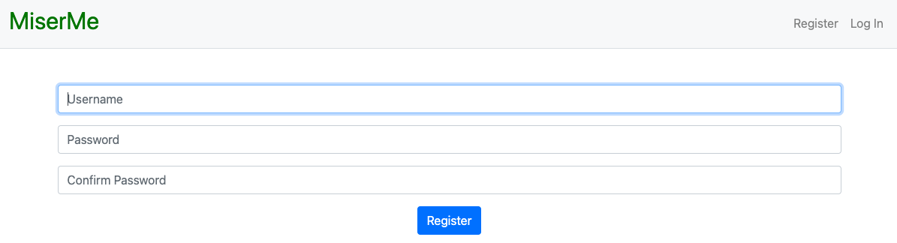

Registered users are free to login with credentials. If incorrect credentials are given, The user will be redirected to an error page.

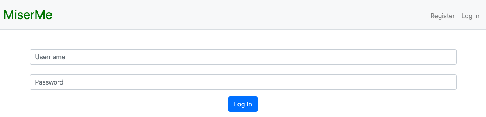

 
 
 

<h2 align="center">Preview: Homepage</h2>

Once logged in, users will be taken to a semi-blank page, signifying the user to start a budget.

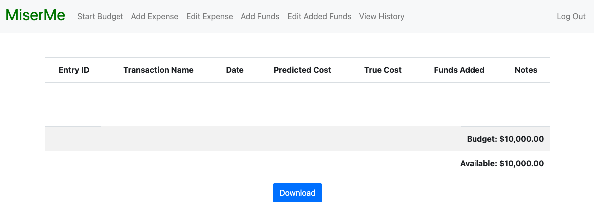

 
 
 

<h2 align="center">Preview: Start Budget</h2>

The user can start a budget by clicking the "Start Budget" option in the navigation bar. They will be prompted to enter a value (budget) that they want to allocate for this period.

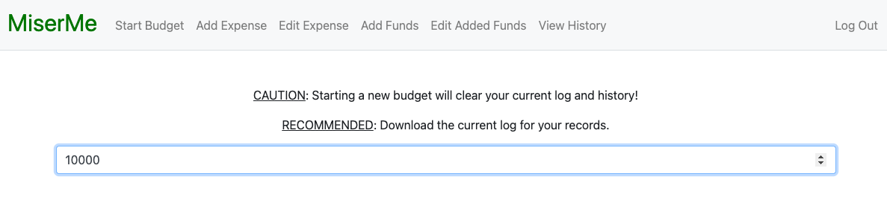

 
 
 

<h2 align="center">Preview: Add Expense</h2>

After a budget is started, users have an option to add an expense (i.e. bills, transactions, etc.). Below is an example of a user entering his rent.

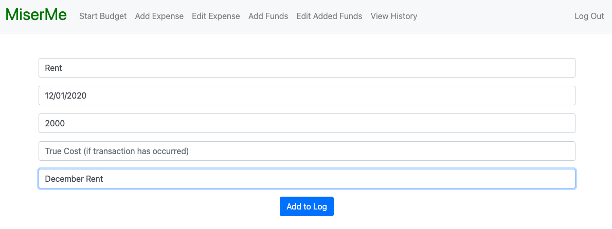

### Please note: Predicted cost is used for transactions that have not yet occurred. True cost is used for transactions that have already taken place.

 
 
 

<h2 align="center">Preview: Homepage after adding an Expense</h2>

This is the homepage after the user adds an expense. As you can see, "Rent" was recorded.

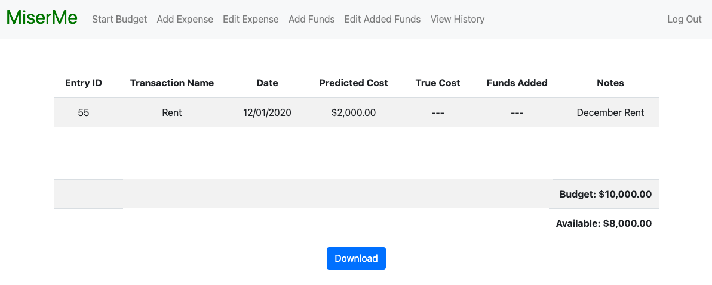

 
 
 

<h2 align="center">Preview: Edit Expense</h2>

Assuming the user made an error, or if the transaction date had past and the user wants to change a "Predicted Cost" into a "True Cost", the user may edit transactions via the "Edit Expense" button in the navigation bar.

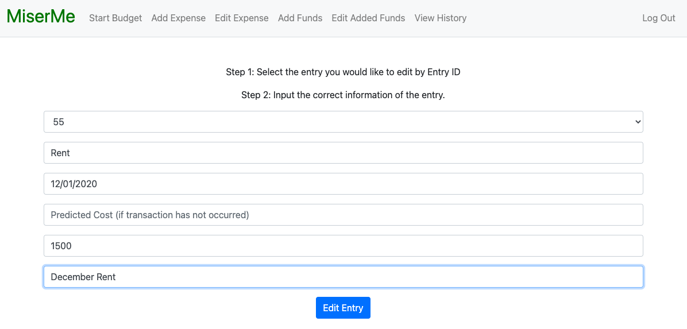

 
 
 

<h2 align="center">Preview: Homepage after editing an Expense</h2>

Below is the homepage after the user had edited the transaction "Rent" to a True Cost $500 less than what he had anticipated.

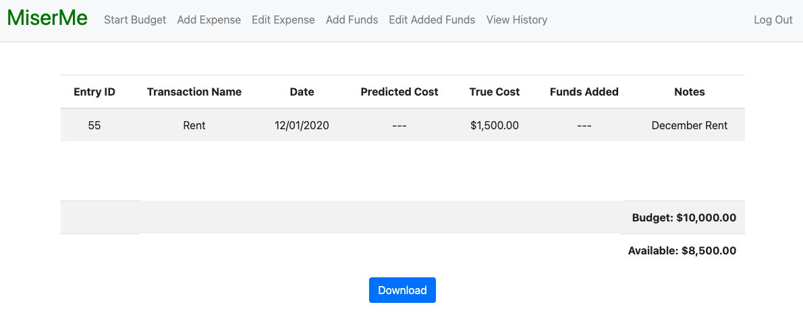

 
 
 

<h2 align="center">Preview: Add Funds</h2>

The user can add funds to their available pool whenever fortune strikes. Here is an example of a user receiving $100 from his grandmother.

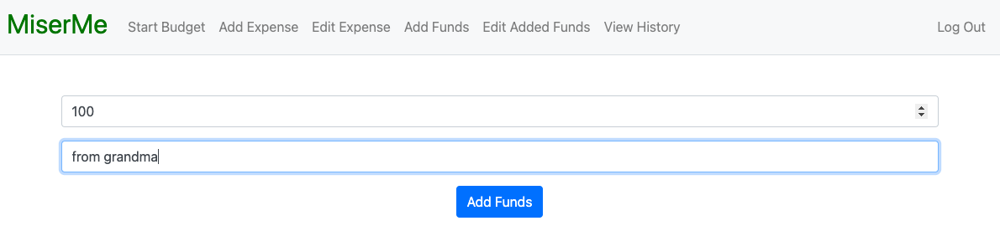

 
 
 

<h2 align="center">Preview: Homepage after adding Funds</h2>

The added funds appears as another transaction. However, rather than decrementing the available funds, the new funds are added.

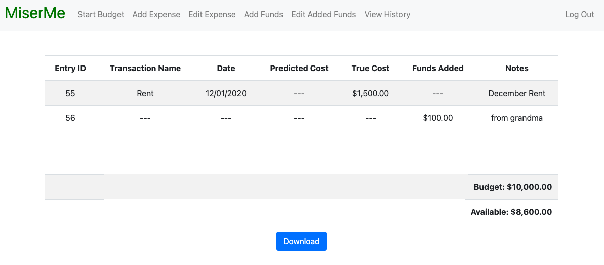

 
 
 

<h2 align="center">Preview: Edit Added Funds</h2>

Perhaps the user made an error when adding in funds? Easily corrected using the "Edit Added Funds" feature. Here is an example of the user's grandmother giving an extra $100.

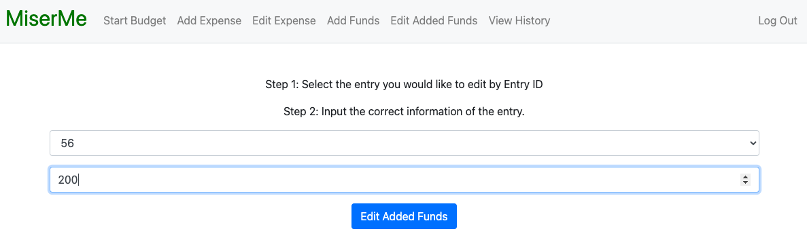

 
 
 

<h2 align="center">Preview: Homepage after editing added Funds</h2>

The homepage is updated with the extra $100 the user received from his grandmother.

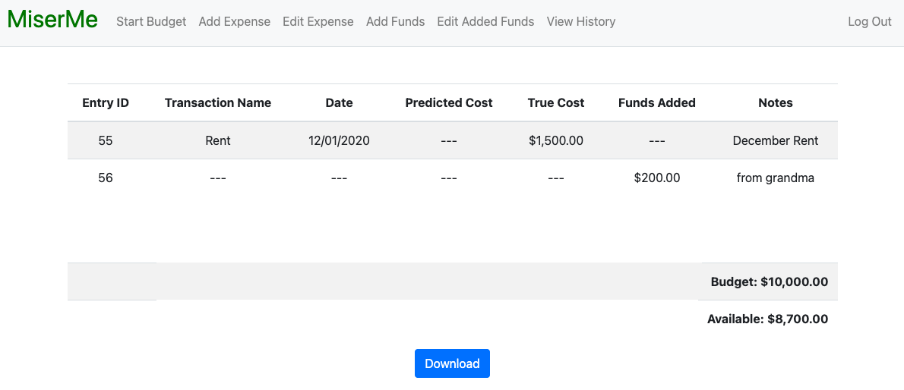

 
 
 

<h2 align="center">Preview: History</h2>

One of the best features of this app is that it provides a snapshot of every change created in the budget. Dont remember where that $200 came from? No worries! Grandma gave it to you ~~~ and she might give you more next month ~~~

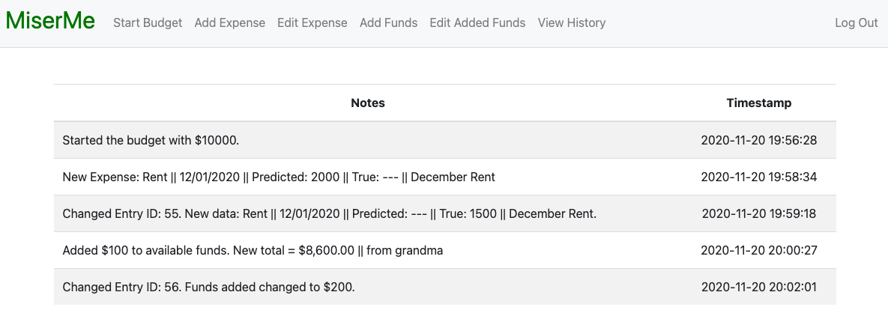

 
 
 

<h2 align="center">Preview: Download</h2>

Another excellent feature of this app is the ability to export all transactions made into a csv file for users that like to keep a record of their budget and stay on top of their finances.

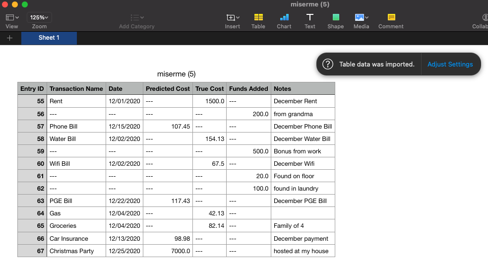

 
 
 

### Logs: the creation of MiserMe

| Date | Major Updates |
| ------------- | ------------- |
| October 7th, 2020 | Began the application: created the flask app, necessary html pages, and the sqlite database file. |
| October 8th, 2020 | Continued the login function in app.py. Created connection to sqlite database, and created the register function. |
| October 12th, 2020 | Added items to style.css, created navbar, completed the login function to accurately read user input. |
| October 13th, 2020 | Registering successfully connects to sqlite3 database. New HTML file to confirm registration. |
| October 15th, 2020 | Fixed the login function: registered can log into the home page. Created logout function. Edited navbar. |
| October 16th, 2020 | Created the 'finances' database, and coded SQL query to retrieve user funds. Temporarily completed index function. Started Homepage html file. |
| N/A | Computer complications led to a temporary pause on development of this app. Development continued after November 4th, 2020. |
| November 4th, 2020 | Created the HTML files for Funds, Expenses, and History. Coded the functions in app.py to load the HTML files. |
| November 5th, 2020 | Completed expense.html file for user expense log; programmed the expense function, debugging to continue. |
| November 6th, 2020 | Completed expense function and properly connected it to index.html. Funds snapshot now displays. |
| November 10th, 2020 | Completed the add_funds function and the add_funds.html file. Adding to available funds now an option. |
| November 11th, 2020 | Completed the history function and the history.html file. Included SQL queries for history in other functions. |
| November 12th, 2020 | Debugged several issues that were causing values to show incorrectly (i.e. changed values to USD $, removed NONE values). |
| November 13th, 2020 | Debugged issues regarding empty values, included true costs in expense function, and included timestamp in history. |
| November 14th, 2020 | Restructured history function: shows detailed description as opposed to a table of entries. Altered all functions to match changes. |
| November 15th, 2020 | Completed "start_budget" function. Corrected decrement feature to available funds when creating expenses. Layout/design changes. |
| November 16th, 2020 | Debugged issues in the add_funds function, created the edit function. Edit function currently only features GET method. |
| November 17th, 2020 | Completed the edit function, added Entry ID to homepage, debugged issues after the creation of edit function. |
| November 18th, 2020 | Completed the edit_add function and the edit_added.html file. User is now able to edit funds that they added to account. |
| November 19th, 2020 | Completed the download function. Tested entire application. Application complete. Now starting restyling for aesthetics. |
| November 20th, 2020 | MiserMe completed. |
